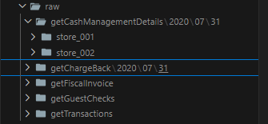

# Desafio de Engenharia de Dados CBLab

Este repositório contém a solução proposta para os desafios 1 e 2 de Engenharia de Dados Júnior da **CBLab**.  
O projeto simula um pipeline de dados completo, desde a ingestão de APIs até o processamento e a disponibilização para consumo, utilizando uma arquitetura em camadas com **Node.js/Express**, **Docker**, **Node-RED** e ferramentas de qualidade de código.

---

## 1. Visão Geral do Projeto

O projeto aborda os desafios de modelagem e ingestão de dados em um cenário de uma rede de restaurantes.  
O objetivo é construir um pipeline de dados funcional que:

- Coleta informações de diversas APIs;
- Armazena os dados em um _data lake_ improvisado (Raw Zone);
- Processa e transforma os dados para um formato estruturado (Processed Zone);
- Disponibiliza os dados para consulta por meio de uma **API de consumo**.

O foco principal é construir um pipeline **robusto, modular e escalável**, seguindo as melhores práticas da Engenharia de Dados.

## 2. Estrutura do Repositório

A organização dos arquivos no diretório raiz (`cblab-desafio/`) segue uma estrutura modular e clara:

```
cblab-desafio/
├── docs/                        # Documentação complementar do projeto
│   ├── data-dictionary.csv     # Dicionário de dados em formato CSV Desafio 1
│   ├── desafio01.png           # Diagrama de modelagem lógica do Desafio 1
│   ├── desafio01.sql          # Transcrição SQL do modelo de dados do Desafio 1
│   └── swagger.json            # Documentação (Swagger) da API
├── nodered_data/               # Volume persistente para dados e fluxos do Node-RED
│   ├── raw/                    # Zona Bruta do Data Lake (JSONs brutos)
│   └── processed/              # Zona Processada do Data Lake (JSONs transformados)
├── src/                        # Código-fonte da aplicação Express
│   ├── controllers/            # Camada de apresentação (lida com requisições HTTP)
│   ├── factories/              # Funções de fábrica para criar objetos completos (Factory Pattern)
│   ├── helpers/                # Funções auxiliares (ex: respostas HTTP padronizadas)
│   ├── repositories/           # Camada de acesso a dados (lida com leitura/escrita de arquivos)
│   └── usecases/               # Camada de lógica de negócio
├── tests/                      # Testes unitários (Jest)
├── api-server.js               # Ponto de entrada principal da API Express 
├── docker-compose.yml          # Definição e orquestração dos serviços Docker
├── Dockerfile                  # Instruções para construir a imagem Docker do api-server
└── nodered.Dockerfile          # Instruções para construir a imagem Docker do Node-RED
```

## 3. Contexto para os Desafios

### Desafio 1 - Modelagem de Esquema e Transcrição para SQL

**Contexto:**  
Analisar o esquema de um JSON de um ERP de restaurante e modelar um banco de dados relacional. É necessário garantir que as tabelas representem entidades reais e acomodem a natureza polimórfica dos dados (`detailLines`).

**Solução:**  
O esquema do `ERP.json` foi analisado e modelado em um banco de dados relacional com 10 tabelas, incluindo entidades mestras como `stores` e `employees`. A modelagem utiliza normalização e chaves primárias/estrangeiras para garantir a integridade dos dados e um design robusto. A estrutura polimórfica dos `detailLines` (discount, serviceCharge, tenderMedia e errorCode) foi resolvida com sucesso através de tabelas de subtipo com relacionamentos 1:1.

- 📄 **[Dicionário de Dados (CSV)](docs/data-dictionary.csv)**: Documenta detalhadamente cada campo do JSON.
- 🧾 **[Transcrição SQL](docs/desafio01.sql)**: Código compatível com MySQL.
- 🖼️ **[Diagrama de Modelagem](docs/desafio01.png)**: Representação lógica do modelo criado.

## 1. Como a Modelagem Foi Realizada e Por Quê

A abordagem principal adotada foi a **normalização de dados**, um pilar da modelagem relacional. Em vez de criar uma única tabela monolítica para cada `guestChecks` (que seria uma representação direta do JSON, mas altamente ineficiente), as entidades lógicas foram separadas em tabelas distintas.

### Entidades Principais

A tabela `guestChecks` foi criada como a entidade central para armazenar os dados de pedido mais genéricos (IDs, totais, datas, informações de funcionário e mesa).

### Tabelas de Referência

As tabelas `stores` e `employees` foram adicionadas acima da tabela `guestChecks`. Esta foi uma decisão estratégica para aprimorar a modelagem, pois em uma rede de restaurantes, as lojas e os funcionários são entidades mestras com informações próprias que não devem ser duplicadas em cada pedido. Isso reflete um modelo de negócio real.

### Relacionamentos

As tabelas são conectadas por chaves primárias e estrangeiras. Por exemplo, `guestChecks.locRef` e `guestChecks.empNum` são chaves estrangeiras que referenciam as chaves primárias (`locRef` e `empNum`) nas tabelas `stores` e `employees`, respectivamente.

Essa separação garante a **integridade dos dados**, evita a **redundância** e melhora o **desempenho das consultas**.

---

## 2. Como Lidar com os Arrays (`taxes`, `detailLines`)

A modelagem de arrays de objetos em um esquema relacional exige uma abordagem cuidadosa, e o método escolhido foi a criação de **tabelas de relacionamento 1:N (um para muitos)**.

### Array `taxes`

O array de impostos em um pedido foi modelado como uma tabela separada: `guestCheck_Taxes`. Cada registro nesta tabela representa um imposto específico aplicado a um pedido.

- A chave estrangeira `guestCheckId` na tabela `guestCheck_Taxes` referencia a chave primária `guestCheckId` na tabela `guestChecks`.
- Isso reflete a cardinalidade 1:N: um pedido pode ter muitos impostos, mas cada imposto pertence a um único pedido.

### Array `detailLines` (modelo polimórfico)

#### Tabela Central

Foi criada uma tabela central `guestCheck_DetailLines` para armazenar os campos comuns a todos os tipos de itens de linha. Esta tabela se relaciona com `guestChecks` em uma relação 1:N.

#### Tabelas de Subtipo (1:1)

Para cada tipo de item que pode estar em `detailLines`, uma tabela separada foi criada (`menuItem`, `discount`, `serviceCharge`, `tenderMedia` e `errorCode`, etc.).

- A chave primária (`guestCheckLineItemId`) da tabela `guestCheck_DetailLines` é usada como chave primária e estrangeira nas tabelas de subtipo.
- Isso cria um relacionamento de **um para um (1:1)** entre `guestCheck_DetailLines` e cada uma das tabelas de subtipo.
- Garante que um item de linha seja de **um e apenas um tipo**.

---

## 3. Justificativa das Escolhas com Base em Operações de Restaurante

- **Controle de Pedidos e Auditoria**: A separação das tabelas permite uma auditoria clara de cada pedido — subtotal, impostos aplicados, descontos e itens vendidos.

- **Cálculo de Impostos e Preços**: A tabela `guestCheck_Taxes` permite que a equipe de BI calcule a arrecadação de impostos por pedido, por tipo de imposto e por loja.

- **Análise de Vendas**: A tabela `menuItem` permite análises detalhadas, como “qual item foi mais vendido” ou “qual faixa de preço é mais popular”.

- **Performance e Escalabilidade**: A normalização e o particionamento implícito por entidades (`stores`, `employees`) tornam o banco mais eficiente em larga escala.

- **Qualidade de Produção**: A modelagem segue boas práticas exigidas por sistemas ERP que demandam alta **integridade referencial** — essencial em ambientes de produção.

---

## 4. Desafio 2 - Datalake e Pipeline de Ingestão e Processamento

### Contexto:

Consumir 5 endpoints de API de uma rede de restaurante e justificar a importância de por que guardar as respostas da API e como iríamos organizar as respostas dentro do data lake da empresa, levando em consideração possíveis mudanças futuras e manter a velocidade das operações de manipulação, verificação, busca e pesquisa.

### Solução:

Foi construído um pipeline de dados funcional e conteinerizado, orquestrado pelo **Node-RED**. A arquitetura da solução foi projetada com base nos padrões do mercado, seguindo o modelo de arquitetura de **data lake em zonas**.

- **Raw Zone (Dados Brutos):**  
  A primeira camada do data lake armazena as respostas das APIs no formato original (`.json`), sem modificações, para garantir a **fidelidade** e a **rastreabilidade** dos dados.

- **Processed Zone (Dados Curados):**  
  A segunda camada armazena os dados que foram **processados, transformados e padronizados**. Nesta etapa, a lógica de negócio lida com a **evolução de esquema**, como a renomeação do campo `taxes` (presente na Raw Zone) para `taxation`.

> 🗂️ A estrutura de armazenamento dos arquivos é **particionada hierarquicamente** por `apiName`, `busDt` (data de negócio) e `storeId`, otimizando operações de **manipulação, verificação, busca e pesquisa**.
> 

### Justificativa:

- **🔍 Rastreabilidade e Auditoria:**  
  O armazenamento dos dados brutos na Raw Zone é crucial para **auditar o pipeline** e permitir o **reprocessamento** dos dados em caso de falhas ou mudanças na lógica de negócio.

- **🧬 Flexibilidade de Esquema (Schema-on-Read):**  
  A arquitetura do data lake permite a ingestão de dados com **esquemas variáveis**, com o `ProcessDataUseCase` sendo responsável por impor o esquema correto apenas na camada de dados curados (**Processed Zone**).  
  Isso torna a solução **resiliente** a futuras mudanças nas APIs de origem.

- **⚡ Performance:**  
  O particionamento dos dados por `apiName`, `busDt` e `storeId` garante que ferramentas de consulta (em um cenário real, como **Apache Spark** ou **Amazon Athena**) possam escanear apenas o subconjunto de dados necessário, melhorando **drasticamente o desempenho das consultas**.

---

## 5. Configuração do Ambiente

### 5.1. Pré-requisitos:

- Ter o **Docker Desktop** instalado e rodando.
- Ter um terminal (ex: **PowerShell** ou **Git Bash**) na pasta raiz do projeto.
- Ter uma conta no **GitHub**.

### 5.2. Passos para Rodar o Projeto:

- Clone o Repositório:

````bash
git clone https://github.com/PedroRomaoDev/cblab-desafio
cd cblab-desafio

### Inicie os Contêineres

Este comando constrói as imagens personalizadas e inicia os serviços em segundo plano:

```bash
docker-compose build

docker compose up -d
````

### Acesse as Interfaces

- **Node-RED:** [http://localhost:1880](http://localhost:1880)
- **API Express (Swagger UI):** [http://localhost:3001/docs](http://localhost:3001/docs)

### Popule o Data Lake

1. No Node-RED, vá direto ao canto superior direito e faça o import dos fluxos, presentes no arquivo [meus_fluxos_nodered_backup.json](./meus_fluxos_nodered_backup.json).
2. Após realizar a importação, clique em nó **implementar** para disparar a ingestão de dados mock.
3. A pasta raw será criada dentro do volume do container, contendo os dados brutos.
4. Para visualizar os dados brutos, você pode acessar a pasta nodered_data/raw.

## Processe os Dados (via API)

A segunda camada (**Processed Zone**) é populada através da API de Processamento.

1. Vá para a interface do Swagger UI em [http://localhost:3001/docs](http://localhost:3001/docs).
2. Na seção **"Processamento de Dados"**, expanda o endpoint `POST /process-data`.
3. Clique em **"Try it out"** e depois em **"Execute"** (com o corpo vazio `{}`).

Isso irá ler os dados da **Raw Zone**, transformá-los e salvá-los na pasta `nodered_data/processed/`.

## 5.3. Testes Unitários

Execute os testes:

```bash
npm test
```

**Resultados:** Você deve ver que todos os testes para os repositórios, use cases e controllers foram executados e passaram com sucesso.

## Rotas das APIs

### GET /raw-zone (Dados Brutos)

### POST /process-data (Disparar Processamento)

### POST /query/{apiName} (Consulta de Dados Processados)

### POST /item-lookup (Consulta de Item por ID)

## 6. Considerações Finais e Melhorias

A arquitetura em camadas e a injeção de dependência foram implementadas para garantir a qualidade de produção, modularidade e testabilidade do código.

O uso de Docker Compose e Node-RED garante um ambiente de desenvolvimento consistente e um pipeline de dados visualmente representável.

### Melhorias Futuras

- Conectar o data lake a um provedor em nuvem (Amazon S3 ou Google Cloud Storage) para maior escalabilidade.
- Adicionar monitoramento e alertas para falhas no pipeline de ingestão/processamento.
- Criar um catálogo de dados para facilitar a descoberta e o uso dos dados.
- Implementar autenticação e autorização para as APIs.

### Quadro Kanban do Projeto

Acompanhe o progresso do desenvolvimento e as tarefas finalizadas neste link:  
[Quadro Kanban](https://github.com/users/PedroRomaoDev/projects/1/views/1?layout=board)

---

Este documento é uma parte da entrega do desafio, complementando o código e as instruções.
